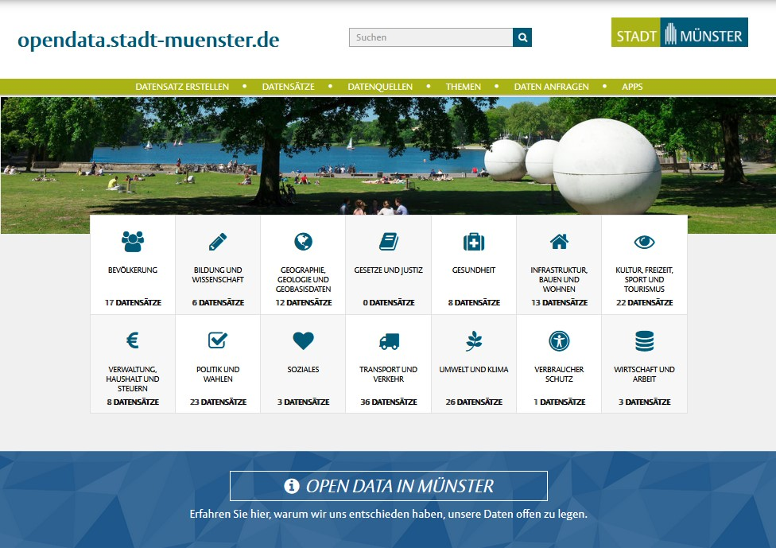
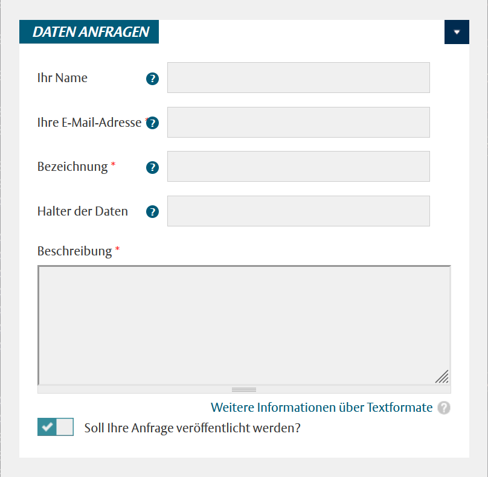
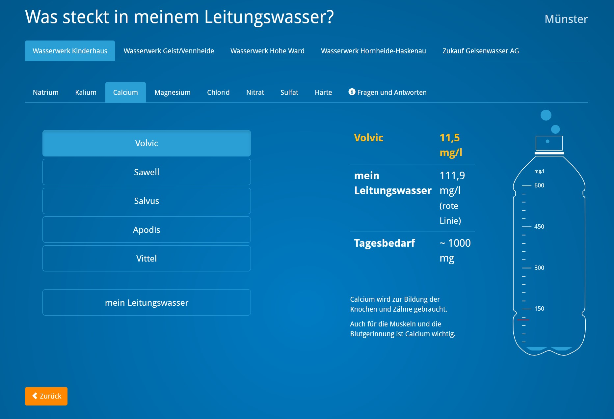
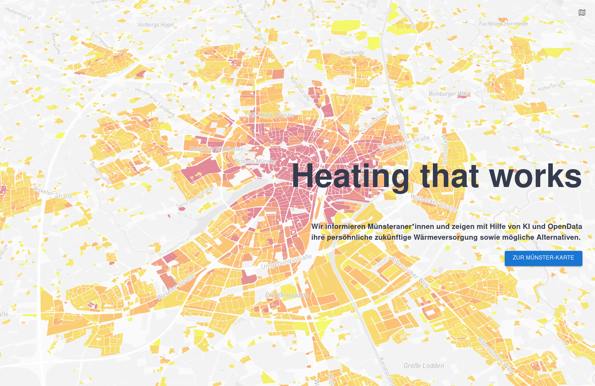
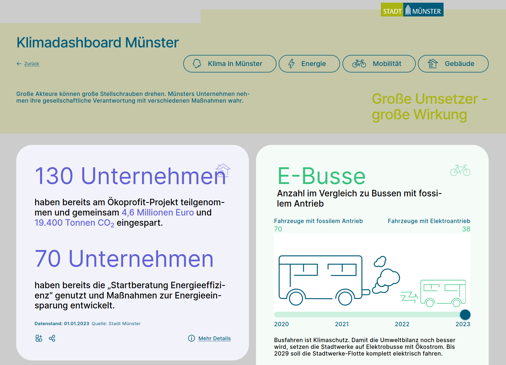

```{r setup, include = FALSE}
# packages
library(dplyr)
library(knitr)
library(xtable)

# settings
knitr::opts_chunk$set(echo = FALSE, message = FALSE, warning = FALSE)
knitr::knit_hooks$set(crop = knitr::hook_pdfcrop)
```

\setlength{\parskip}{2mm plus1mm minus1mm}

\maketitle
\tableofcontents
\addcontentsline{toc}{section}{Inhalt}
\clearpage


\section{Jahresrückblick 2023}

*Die Open-Data-Initiative der Stadtverwaltung Münster ist im Jahr 2018 gestartet. Seitdem ist das Ziel, möglichst viele Daten aus dem Stadtkonzern zu veröffentlichen. Außerdem sollen Open-Data-Nutzer sowie die Entwicklung von Apps und Anwendungen mit Open Data der Stadt Münster unterstützt werden.*

*Dieser Jahresrückblick gibt einen kurzen Überblick, was die Open-Data-Koordination im Jahr 2023 umgesetzt hat.*

\subsection{Open Data in der Stadtverwaltung Münster}

Münster bietet mit der Wirtschaftsförderung, dem DigitalHub und den studentischen Gründungsinitiativen ein gutes Umfeld für Startup-Unternehmen im IT-Bereich. Außerdem gibt es durch die informatiknahen Studiengänge der Universität und der Fachhochschulen viele digitalaffine Studierende. Verschiedene Organisationen und Vereine beschäftigen sich zudem mit digitaler Bildung und digitalem bürgerschaftlichem Engagement, was dazu beiträgt, dass die Bürgerschaft generell ein hohes Maß an Datenkompetenz besitzt.

Aus dieser Zielgruppe kommen regelmäßig Anfragen an die Stadtverwaltung zur Veröffentlichung von Daten. Seit der Verbreitung der Prinzipien von Open Government in Europa ist es für viele Bürger außerdem selbstverständlich geworden, dass korrekte Fakten und Informationen aus zuverlässigen, staatlichen Quellen frei zur Verfügung stehen.

Die Stadtverwaltung Münster bedient diese Bedarfe durch die Open-Data-Initiative und erhält dafür viel positives Feedback. Das städtische Open-Data-Angebot kann im Vergleich mit anderen Großstädten gut mithalten. Einige Datensätze aus Münster waren deutschlandweit Vorreiter, wie z.B. die Live-Buspositionen oder die Energieverbrauchsdaten der städtischen Gebäude. Als Ergebnis gibt es regelmäßig innovative Ideen und Impulse, wie städtische Daten genutzt werden können.

Leider können aber einige Datenanfragen nicht positiv beantwortet werden. Für die Veröffentlichung von städtischen Daten als Open Data müssten Daten oft noch manuell exportiert und veröffentlich werden. Der Vergleich mit anderen Kommunen zeigt, dass es von Vorteil ist, das Thema "Daten" amtsübergreifend zu organisieren. Dabei kann auch eine zentrale Daten-Infrastruktur, wie z.B. eine urbane Datenplattform, helfen, aus der Daten automatisch zur Verfügung gestellt werden können.

Großes Potenzial liegt daher in einer organisatorischen und technischen Besetzung des Themas "Daten" in der Stadtverwaltung Münster. Dies würde nicht nur dem Ziel einer effizienteren Veröffentlichung von Daten für externe Nutzer dienen. Es würde auch neue Möglichkeiten schaffen, innerhalb des Stadtkonzerns amts- und themenübergreifend mit Daten zu arbeiten und Erkenntnisse aus städtischen Daten zu gewinnen. Beispiele dafür wären die Nutzung künstlicher Intelligenz oder die Einführung moderner Verfahren der Datenanalyse.

\hspace{12pt}


:::::: {.cols data-latex=""}

::: {.col data-latex="{0.55\textwidth}"}

```{r, out.width = "250pt"}

```
*Bildschirmfoto: opendata.stadt-muenster.de*


:::

::: {.col data-latex="{0.05\textwidth}"}
\ 
<!-- an empty Div (with a white space), serving as
a column separator -->
:::

::: {.col data-latex="{0.4\textwidth}"}

\setlength{\parskip}{2mm plus1mm minus1mm}

**Das städtische Open-Data-Portal**

Über das kommunale Open-Data-Portal Münster werden offene Daten des Stadtkonzerns und weiterer lokaler Organisationen bereitgestellt. Es ist zentrale Anlaufstelle für Nutzerinnen und Nutzer, die nach kommunalen Daten in Münster suchen.

Die Daten werden unter der offenen Lizenz "Datenlizenz Deutschland 2.0" veröffentlicht und dürfen kostenfrei genutzt werden. Bedingung ist Angabe der Datenquelle "Stadt Münster".

Internetadresse:\
**https://opendata.stadt-muenster.de**

:::
::::::

\newpage
\subsection{Aktivitäten der Open-Data-Koordination}

**Das Jahr 2023 in Zahlen**

```{r, echo=FALSE}
source("block-das-jahr-in-zahlen.R", print.eval = TRUE)
# or sys.source("your-script.R", envir = knitr::knit_global())
```


**Die Aktivitäten kurz zusammengefasst**

Ein Ziel der Open-Data-Initiative ist Motivation von Anwendungen, von denen Open Data der Stadt Münster genutzt wird. Im Jahr 2022 hat die Open-Data-Koordination zusammen mit dem Smart-City-Team daher das vom Bund geförderte Projekt DIGIFARM.MS in Münster gestartet. Ehrenamtliches Engagement im Open-Data- und Open-Source-Bereich soll sichtbarer gemacht und besser gewürdigt werden. Die Verstetigung des Projekts über den Förderzeitraum hinaus stand im Jahr 2023 im Fokus.

Zusätzlich wurden folgende Aktivitäten durchgeführt:

* Pflege der Open-Data-Datensätze sowie Betreuung des Open-Data-Portals und der Open-Data-Anfragen.
* Zusammenarbeit mit anderen kommunalen IT-Dienstleistern und Kommunen im Arbeitskreis Open $\\$  Government des Dachverbandes kommunaler IT-Dienstleister (KDN).
* Austausch und Machbarkeitsprüfung zur Veröffentlichung von "Linked Open Data" mit weiteren Kommunen aus NRW.
* Weiterführung der Open-Data-Musterklauseln für Ausschreibungsunterlagen von Kommunen.
* Beteiligung an der Erstellung der neuen Version des Musterdatenkataloges, der eine deutschlandweite Bestandsaufnahme der von Kommunen veröffentlichten offenen Daten darstellt.
* Teilnahme am MÜNSTERHACK 2023, um Stadtvisionären bei der Umsetzung ihrer Ideen zu helfen.

Weitere Informationen finden sich im Blog des Open-Data-Portals unter dem Menüpunkt "Themen":\
**https://opendata.stadt-muenster.de/blog**

\section{Für welche Daten interessieren sich die Nutzerinnen und Nutzer?}

\subsection{Top 10 der bereits verfügbaren Datensätze}

Die beliebtesten Open-Data-Datensätze auf dem Open-Data-Portal können der folgenden Tabelle entnommen werden. Im Jahr 2023 ist erwartungsgemäß das Interesse an Corona-Datensätzen zurückgegangen. Stattdessen wurden Datensätze mit Geokoordinaten häufiger gesucht.


```{r, echo=FALSE}
library(flextable)
data <- read.csv(file = 'data/beliebteste-datensaetze.csv', sep=',',
                 dec=".", stringsAsFactors=FALSE,
                 colClasses=c(rep("character",3))
)

# We create an empty row, "Datensatz", so we can append the hyperlinks to it (from the Column "DatensatzName")
names(data)[1] <- "Platz"
names(data)[2] <- "DatensatzName"
data$Datensatz = ""

data <- head(data, 10)

theme_design <- function(x) {
  x <- border_remove(x)
  std_border <- fp_border_default(width = 1, color = "white")
  x <- fontsize(x, size = 8, part = "all")
#  x <- font(x, fontname = "Helvetica", part = "all")
  x <- font(x, fontname = "Lato-Bold", part = "all")
  x <- align(x, align = "center", part = "all")
  x <- bold(x, bold = TRUE, part = "all")
  # bg() kann Hintergründe spaltenweise setzen:
  #   j = Nr der Spalte
  #   i = Nr der Zeile
  x <- bg(x, bg = "#273f47", j=1, part = "body")
  x <- bg(x, bg = "#475f77", j=2, part = "body")
  x <- bg(x, bg = "#eb5555", part = "header")
#  x <- bg(x, bg = "#1bbbda", part = "footer")
  x <- color(x, color = "white", part = "all")
  x <- padding(x, padding = 3, part = "all")
  x <- width(x, j = 1, 15, unit = "mm")
  x <- width(x, j = 2, 13, unit = "cm")
  x <- border_outer(x, part="all", border = std_border )
  x <- border_inner_h(x, border = std_border, part="all")
  x <- border_inner_v(x, border = std_border, part="all")
  x <- append_chunks(x, j=2, hyperlink_text(x = data$DatensatzName, url = data$Link),)
  x <- set_table_properties(x, layout = "fixed")
  x
}

flextable(select(data,Platz,Datensatz)) %>%
  theme_design()

```

Wie wurde diese Top 10 ermittelt?\
Die beliebtesten Datensätze wurden aus den monatlichen, durch MATOMO ermittelten Zugriffszahlen der Datensatzbeschreibungsseiten ermittelt. Auf Grund der verteilten technischen Infrastruktur werden keine Zugriffe auf die Open-Data-Datensätze selbst gezählt. Die Anzahl der Direkt-Zugriffe kann also nicht ausgewertet werden. Sie hätte nur bedingte Aussagekraft, da die Häufigkeit der Datenabrufe stark nach Datensatztyp variiert und nur wenig Schlüsse auf die Beliebtheit der Daten zulässt: Live-Daten aktualisieren sich ständig und müssen für einen Anwendungsfall häufig abgerufen werden (z.B. Aasee-Gewässerqualität alle 15 Minuten). Bei statistischen Daten, die nur ein Mal im Jahr aktualisiert werden, reicht dagegen ein einziger Abruf, wenn man diese Daten nutzen und auswerten möchte.

\subsection{Interesse an noch unveröffentlichten Daten}


:::::: {.cols data-latex=""}

::: {.col data-latex="{0.35\textwidth}"}

```{r, out.width = "170pt"}

```

:::

::: {.col data-latex="{0.05\textwidth}"}
\ 
<!-- an empty Div (with a white space), serving as
a column separator -->
:::

::: {.col data-latex="{0.60\textwidth}"}

\setlength{\parskip}{2mm plus1mm minus1mm}

Im Jahr 2023 wurde das Online-Anfrage-Formular des Open-Data-Portals 19-mal durch Bürger genutzt, um die Veröffentlichung von Datensätzen aus dem Stadtkonzern anzufragen. Es wurden besonders oft Daten aus der Kategorie "Geographie, Geologie und Geobasisdaten" angefragt, konkret nach Flächennutzungsplänen, Bebauungsplänen und Bauleitplänen.

Zusätzlich gingen ähnlich viele Anfragen per Mail an die Open-Data-Koordination unter opendata(at)citeq.de ein. In einigen Fällen konnten diese Anfragen durch Hinweise auf bereits veröffentlichte Daten von anderen Stellen, wie z.B. Landesbehörden, beantwortet werden.

Adresse des Datenanfrageformulars:\
https://opendata.stadt-muenster.de/daten/anfragen

:::
::::::

Von den 19 konkret an die Stadtverwaltung Münster gerichteten Anfragen konnten acht erfüllt werden und bei sechs ist eine Veröffentlichung geplant, aber noch nicht abgeschlossen. Bei den fünf Datensätzen, die nicht veröffentlicht werden konnten, war der Grund entweder, dass die Stadt Münster nicht Urheberin der angefragten Daten ist, oder dass die Daten (noch) nicht in der geforderten Qualität verfügbar sind. Beispiele für noch nicht erfüllte Anfragen sind z.B. Daten aller Straßenlaternenstandorte, das Baumkataster oder stadtviertelgenaue KFZ-Zulassungszahlen.


\section{Was wird mit Open Data der Stadt Münster gemacht?}

\subsection{Wer nutzt Open Data der Stadt Münster?}

Ein Prinzip von "Offenen Daten" ist, dass der Zugriff auf die Daten so niederschwellig wie möglich ist. Die Nutzung kann anonym und ohne Meldung oder Registrierung erfolgen. Im Umkehrschluss erhalten Open-Data-Bereitstellende keine Kenntnis davon, wer die Daten abruft oder ob mit den Daten Anwendungen erstellt werden.

Vielmehr haben z.B. Startup-Unternehmen, die neue Geschäftsmodelle durch Nutzung von Open Data schaffen, ein Interesse daran, ihre Datennutzung geheim zu halten, um ihren Konkurrenzvorteil nicht zu verlieren. Auch Studierende, die für eine Studienarbeit Open Data nutzen, haben keine Vorteile davon, die Stadtverwaltung über ihre Ausarbeitung zu informieren.

Dies sind nur zwei Gründe, warum nur wenige Anwendungsfälle von Open Data der Stadt Münster bekannt werden.

Aus den Anfragen an die Open-Data-Koordination lassen sich aber folgende Interessengruppen identifizieren:

*	Bürgerinnen und Bürger mit Eigeninteresse an einem bestimmten Thema, oft Freizeitentwickler
*	Wissenschaftlerinnen (Universität, Fachhochschule), z.B. Studierende, auch überregional
*	Lokale, gemeinnützige Organisationen (Techlabs, CodeForMünster, Corellaid)
* Initiativen aus den Bereichen Verkehr, Klima, digitale Bildung
*	Startup-Unternehmen
* Planungsbüros und Architekten
* Politisch engagierte Menschen

Es ist zu beobachten, dass Anfragen primär aus dem Raum Münster kommen. Vereinzelte überregionale Anfragen kamen in 2023 von Studierenden und Forschenden, z.B. für Bachelorarbeiten mit überregionalem Bezug, oder weil von der Stadt Münster besonders interessante Datensätze angeboten werden, die andere Städte nicht bieten. Ein Beispiel ist die Live-Schnittstelle mit Bus-Positionsdaten, bei der die Stadtwerke Münster unter den Vorreitern waren.


\subsection{Konkrete Beispiele für Datennutzung}


:::::: {.cols data-latex=""}

::: {.col data-latex="{0.4\textwidth}"}

\setlength{\parskip}{2mm plus1mm minus1mm}

**Was steckt in meinem Leitungswasser?**\
Wussten Sie, dass das Münsteraner Trinkwasser mehr Calcium enthält als die meisten Mineralwasser-Flaschen aus dem Supermarkt?

Die ehrenamtlich Aktiven von "CodeForMünster" haben eine Internetseite erstellt, die dies interaktiv darstellt. Basierend auf einer Open-Source-Anwendung aus Heilbronn werden die Trinkwassermesswerte der Stadtwerke Münster anschaulich dargestellt.

**[codeformuenster.org/trinkwasser](https://codeformuenster.org/trinkwasser)**

:::


::: {.col data-latex="{0.05\textwidth}"}
\ 
<!-- an empty Div (with a white space), serving as
a column separator -->
:::

::: {.col data-latex="{0.55\textwidth}"}
```{r, out.width = "250pt"}

```
:::
::::::

 $\\$

:::::: {.cols data-latex=""}

::: {.col data-latex="{0.55\textwidth}"}

```{r, out.width = "250pt"}

```

\hspace{32pt}

:::

::: {.col data-latex="{0.05\textwidth}"}
\ 
<!-- an empty Div (with a white space), serving as
a column separator -->
:::

::: {.col data-latex="{0.4\textwidth}"}

\setlength{\parskip}{2mm plus1mm minus1mm}

**Geodaten zu Gebäuden und Energie**\
Beim Münsterhack 2023 hat das Team "Meine Wärmeplanung" eine Webseite erstellt, die den Wärmebedarf für Gebäude im Stadtgebiet anzeigen kann. Gebäudebesitzer können sich niederschwellig über Verfügbarkeit und geschätzte Kosten von Fernwärme informieren. Die Wärmenetzpläne lagen dabei leider nicht maschinenlesbar vor, weswegen das Team PDF-Dateien analysieren musste.

**[www.meinewaermeplanung.de](http://www.meinewaermeplanung.de)**
:::
::::::

 $\\$

:::::: {.cols data-latex=""}

::: {.col data-latex="{0.4\textwidth}"}

\setlength{\parskip}{2mm plus1mm minus1mm}

**Aktivitäten zur Klimaneutralität**\
Wo steht Münster auf dem Weg zur Klimaneutralität? Wie zeigen sich Fortschritte beim Klimaschutz? Und wie sind die Folgen des Klimawandels in Münster eigentlich sichtbar?

Im Klimadashboard Münster wurden durch das Smart-City-Team der Stadtverwaltung viele Datenquellen erschlossen und als Open Data veröffentlicht. An diesen Zahlen lassen sich die Aktivitäten zur Klimaneutralität nachverfolgen.

**www.klimadashboard.ms**

:::


::: {.col data-latex="{0.05\textwidth}"}
\ 
<!-- an empty Div (with a white space), serving as
a column separator -->
:::

::: {.col data-latex="{0.55\textwidth}"}
```{r, out.width = "250pt"}

```
:::
::::::

\newpage


\subsection{Ideen mit großem Potenzial}

Folgende Ideen zeigen weitere Beispiele, wozu offene Daten genutzt werden könnten. Diese Ideen sind in Münster noch nicht umgesetzt.

**Routenplanung durch angstfreie Räume**\
Es gibt die Idee eines Routenplaners, der nur Wege anzeigt, die hell erleuchtet sind. Mit einer Liste der Standorte aller Straßenlaternen der Stadt könnte man für den Nachhauseweg zu später Stunde alle Routen anzeigen, die durch Straßenlaternen erleuchtet sind. Eine tolle Funktion, die noch kein Routenplaner bietet. Es fehlt dazu die Veröffentlichung der Standorte aller Straßenlaternen. Wir bleiben dran!

**Hilfe für austrocknende Bäume**\
In Münster gibt es bereits die Kampagne "Münster schenkt aus": Anwohner können beim Gießen der Bäume vor ihrer Haustüre helfen. Als Erweiterung kann die digitale Open-Source-App "Gieß den Kiez" aus Berlin helfen: Der Wasserbedarf von Bäumen wird angezeigt und man kann ein digitales Gieß-Tagebuch führen. Leider fehlt in Münster das digitale Baumkataster. Bei fast 150.000 Bäumen eine Mammutaufgabe, aber wir sind dran!

**Fahrraddiebstähle mit künstlicher Intelligenz aufklären?**\
Die Polizei Berlin veröffentlicht seit 2021 täglich die Daten aller aktuellen Fahrraddiebstähle als Open Data. Zu jedem Diebstahl wird das Stadtviertel, der Zeitraum, die Art des Fahrrads und die Schadenshöhe veröffentlicht. Die Polizei erhofft sich, dass Expertinnen und Experten neue Erkenntnisse aus den Daten ziehen können, da ein Großteil der Diebstähle leider unaufgeklärt bleibt. Wäre das eine Idee für Münster?

\section{Statistiken zum Open Data Portal}


\subsection{Zugriffszahlen des Open-Data-Portals}
Die Zugriffszahlen des Open-Data-Portals sind in den letzten beiden Jahren fast konstant geblieben. Pro Monat besuchen 1400 bis 2000 Menschen das Open-Data-Portal und rufen dabei 4000-6000 Seiten ab. Diese Zahlen wurden mit der datensparsamen Open-Source–Anwendung "MATOMO" erhoben, die für die Homepages aller Ämter der Stadtverwaltung Münster genutzt wird.

```{r, echo=FALSE, fig.width=5, fig.height=1.5, out.width="100%"}
source("block-zugriffszahlen.R", print.eval = TRUE)
```


\subsection{Veröffentlichte Datensätze}

:::::: {.cols data-latex=""}

::: {.col data-latex="{0.55\textwidth}"}
```{r, echo=FALSE, fig.width=5, fig.height=4, out.width="100%"}
source("block-kategorien-kuchen.R", print.eval = TRUE)
```
:::

::: {.col data-latex="{0.05\textwidth}"}
\ 
<!-- an empty Div (with a white space), serving as
a column separator -->
:::

::: {.col data-latex="{0.4\textwidth}"}

\setlength{\parskip}{2mm plus1mm minus1mm}

Zum 31.12.2023 gab es auf dem Open-Data-Portal 174 Datensätze. Davon wurden 25 Datensätze im Jahr 2023 erstmals veröffentlicht.

Die Abbildung auf der linken Seite zeigt, wie viele Datensätze in den verschiedenen Kategorien auf dem Open-Data-Portal derzeit verfügbar sind. Diese Kategorien werden von den meisten Kommunen in NRW einheitlich verwendet und entsprechen den Kategorien auf dem Open-Data-Portal des Landes NRW.

:::
::::::


<!--
See Figure \@ref(fig:cars-plot).

```{r cars-plot, fig.cap="The cars data.", echo=FALSE, fig.align="right", out.width="50%"}
par(mar = c(4, 4, .2, .1))
plot(cars)  # a scatterplot
```
-->


\subsection{Aktualisierung der Daten}


:::::: {.cols data-latex=""}

::: {.col data-latex="{0.5\textwidth}"}
\setlength{\parskip}{2mm plus1mm minus1mm}

Für fast die Hälfte der Datensätze (48%) auf dem Open-Data-Portal ist eine manuelle Aktualisierung notwendig. Die restlichen Datensätze aktualisieren sich automatisch aufgrund der technischen Anbindung direkt an städtische Systeme (20%) oder es handelt sich um statische Datenabzüge (32%), wie z.B. die amtlichen Endergebnisse der Landtagswahl 2022.

:::

::: {.col data-latex="{0.05\textwidth}"}
\ 
<!-- an empty Div (with a white space), serving as a column separator -->
:::

::: {.col data-latex="{0.45\textwidth}"}

```{r, echo=FALSE, crop=TRUE, fig.pos = "!H", fig.align="left", fig.width=5, fig.margin=FALSE, fig.height=2.5, out.width = "220pt"}
par(bg = "antiquewhite", mai=c(.3,1,.3,1))

data <- data.frame(Format=c("Automatische\nAktualisierung\n", "Einmaliger\nDatenexport\n", "Manuelle\nAktualisierung "),
                             Anzahl=c(20, 32, 48))
data$Label <- paste0( data$Format, "(", data$Anzahl, "%)" )

# Prepare a color palette with ColorBrewer
library(RColorBrewer)
myPalette <- brewer.pal(12, "Dark2")

# Draw pie chart
pie(data$Anzahl, labels = data$Label, border="white", col=myPalette , radius = 1, cex=1.2)
```
:::
::::::


\subsection{Dateiformate der angebotenen Daten}


:::::: {.cols data-latex=""}

::: {.col data-latex="{0.55\textwidth}"}

```{r, echo=FALSE, crop=TRUE, fig.pos = "!H", fig.align="left", fig.width=5, fig.margin=FALSE, fig.height=4, out.width = "250pt"}
source("block-datenformate.R", print.eval = TRUE)
```
:::

::: {.col data-latex="{0.05\textwidth}"}
\ 
<!-- an empty Div (with a white space), serving as a column separator -->
:::

::: {.col data-latex="{0.4\textwidth}"}
Die für die Veröffentlichung genutzten Dateiformate hängen mit den Veröffentlichten Datenarten zusammen:

- Für Geodaten eignen sich *shape*-, *wms*-, *wfs*-, *kml*- und *geojson*-Dateien
- Für tabellarische Daten werden *csv*- und *excel*-Dateien genutzt
- Längere textuelle Datensatzbeschreibungen und Reports stehen in *pdf*-Dateien

Dies spiegelt sich in der Anzahl der pro Dateiformat verfügbaren Ressourcen wider, die im Kuchendiagramm links dargestellt wird.

:::
::::::

\section{Ausblick 2024}
Im Jahr 2024 werden die bestehenden Open-Data-Aktivitäten weitergeführt, wie die Pflege des Open-Data-Portals, die Veröffentlichung und Aktualisierung von Datensätzen, und die Durchführung von Veranstaltungen wie dem "Open Data Day" am 5. März. Ergänzend sollen insbesondere folgende Themen bearbeitet werden:

```{r, echo=FALSE, fig.width=5, fig.margin=FALSE, fig.height=3.2, out.width = "100%"}
# par(cex=0.8)
source("block-ausblick-2024.R", print.eval = TRUE)
```

<!--
**Ziel #1: Bessere Daten-Visualisierungen**\
Visualisierungstools wie interaktive Karten, Diagramme und Infografiken können die Zugänglichkeit und Verständlichkeit der bereitgestellten Daten verbessern. Damit kann ein breiteres Spektrum von Nutzern angesprochen werden. Eine gezielte Evaluation und Auswahl geeigneter Visualisierungsmethoden wird angestrebt, um Open Data für eine breitere Zielgruppe zugänglich zu machen und somit die Transparenz und Partizipation zu fördern.

**Ziel #2: Verbesserung der Datenhaltung**\
Um die Effizienz der Datenveröffentlichung zu steigern und die Datenhaltung zu verbessern, wird die Entwicklung und Umsetzung einer Datenstrategie sowie einer gemeinsamen technischen Daten-Infrastruktur für die Stadt Münster angestrebt. Die Open-Data-Koordination unterstützt entsprechende Initiativen des Smart City Teams. Eine gute Organisation und Strukturierung städtischer Daten bildet die Grundlage für eine datengetriebene Entscheidungsfindung und Innovation in der Stadtentwicklung.

**Ziel #3: Unterstützung der Open-Data-Community**\
Vernetzung bietet nicht nur die Möglichkeit, Erfahrungen und Fachkenntnisse von außen einfließen zu lassen, sondern auch potenzielle Partnerschaften zu knüpfen und gemeinsam an Lösungen für lokale Herausforderungen zu arbeiten. Daher wollen wir auch in 2024 bei Veranstaltungen präsent sein und außerdem die Vernetzung mit lokalen Startups sowie der Open-Source-Community suchen. Ein Baustein, der Nachhaltigkeit für Entwicklungen aus der Bürgerschaft schaffen soll, ist das Projekt DIGIFARM.MS, das durch die Open-Data-Initiative unterstützt wird.
-->

\section{Mitmachen}

\subsection{Kontakt zur Open-Data-Initiative Münster}

Bei der Open-Data-Initiative der Stadt Münster ist die Beteiligung durch die Stadtgesellschaft ausdrücklich erwünscht.

Sie müssen kein Daten-Profi sein, um städtische Daten zu nutzen.

Wofür können Sie städtisches Open Data einsetzen?

* Sie möchten Fakten zu einem bestimmten Thema überprüfen oder Ihre Informationen mit kommunalen Daten abgleichen?
* Sie möchten programmieren lernen oder die Nutzung eines Tabellenprogramms erlernen und möchten dafür "echte" Daten nutzen?
* Sie möchten nur mal schauen, welche Daten die Stadt Münster anbietet?


Sie finden das Open-Data-Portal der Stadt Münster unter der folgenden Internetadresse:

**https://opendata.stadt-muenster.de**
\ 


Bei Fragen rund um Offene Daten kontaktieren Sie bitte die Open-Data-Koordination:

**Open Data Koordination Münster**

Email: **opendata(at)citeq.de**

Telefon: **0251 / 492-1909**

\subsection{Weiterführende Links}

* Blog auf dem Open-Data-Portal: **https://opendata.stadt-muenster.de/blog**
* Alle Datensätze durchsuchen: **https://opendata.stadt-muenster.de/dataset**
* Liste von Anwendungen mit Open Data: **https://opendata.stadt-muenster.de/anwendungen**


$\\$ $\\$ $\\$ $\\$ $\\$
 $\\$ $\\$ $\\$ $\\$ $\\$
  $\\$ $\\$ $\\$ $\\$ $\\$
   $\\$ $\\$ $\\$ $\\$ $\\$
  $\\$ $\\$ $\\$ $\\$ $\\$
 $\\$ $\\$ $\\$ $\\$ $\\$
$\\$ $\\$ $\\$ $\\$ $\\$


Dieser Jahresrückblick wurde mit der statistischen Programmiersprache "R" erstellt. $\\$
Der Programmcode steht unter der Lizenz GPL 3.0 und kann frei weiterverwendet werden. $\\$ $\\$
Zu finden ist der Quellcode dieses Berichts unter folgender Adresse: $\\$
**https://opendata.stadt-muenster.de/jahresrueckblick**

